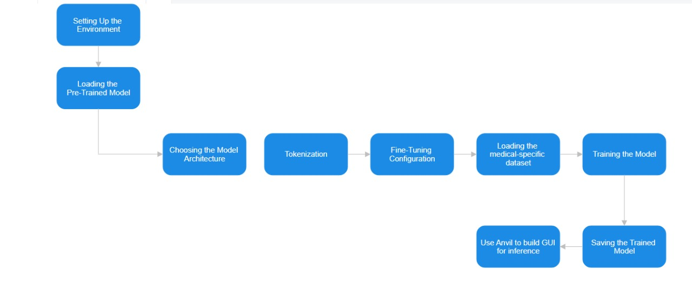

# Healthcare Chatbot
## Table of Contents  
- [About the Project](#about-the-project)  
    - [Aim](#aim)  
    - [Description](#description)  
    - [Tech Stack](#tech-stack)  
    - [File Structure](#file-structure)  
- [Getting Started](#getting-started)  
    - [Prerequisites](#prerequisites)   
    - [Execution](#execution)  
- [Theory and Approach](#theory-and-approach)   
- [Results and Demo](#results-and-demo)  
- [Future Work](#future-work)  
- [Contributors](#contributors)  
- [Acknowledgement and Resources](#acknowledgement-and-resources)  
## About the Project
### Aim:
The prime Objective of the project is to develop a chatbot which interacts with the user in question-answer format to provide the required personalized and reliable healthcare information and support.
### Description:
The HealthBuddy Chatbot aims to create a versatile chatbot that can offer assistance in various aspects of healthcare, including symptom diagnosis, mental health consultation, nutrition guidance, and more. The inspiration behind this project is to empower users to make informed healthcare decisions and promote overall well-being.
This objective is satisfied by fine-tuning an already existing LLM on a medical-specific dataset.

### Tech Stack
#### We have used the following technologies for this project:
- [Python](https://www.python.org/)
- [Numpy](https://numpy.org/doc/#)
- [Pytorch](https://pytorch.org/)
- [Google Colab](https://colab.research.google.com/)

### File Structure

    ├── assets
    │   ├── Flowchart1.jpeg
    │   ├── Flowchart2.jpeg
    │   ├── Result1-CHATGPT.png
    │   ├── Result1-Finetuned.png
    │   ├── Result2-CHATGPT.png
    │   └── Result2-Finetuned.png
    ├── Coursera-Notes
    │   ├── Course1.md
    │   ├── Course2.md
    │   ├── Course5.md
    │   └── GenerativeAI_LLM_Coursera.pdf
    ├── Coursera-Programming-Assignments
    │   ├── 01.Python_Basics_with_Numpy.ipynb
    │   ├── 02.Logistic_Regression_with_a_Neural_Network_mindset.ipynb
    │   ├── 03.Planar_data_classification_with_one_hidden_layer.ipynb
    │   ├── 04.Building_your_Deep_Neural_Network_Step_by_Step.ipynb
    │   ├── 05.Deep Neural Network - Application.ipynb
    │   ├── 06.Initialization.ipynb
    │   ├── 07.Regularization.ipynb
    │   ├── 08.Gradient_Checking.ipynb
    │   ├── 09.Optimization_methods.ipynb
    │   ├── 10.Tensorflow_introduction.ipynb
    │   ├── 11.Building_a_Recurrent_Neural_Network_Step_by_Step.ipynb
    │   ├── 12.Dinosaurus_Island_Character_level_language_model.ipynb
    │   ├── 13.Improvise_a_Jazz_Solo_with_an_LSTM_Network_v4.ipynb
    │   ├── 14.Operations_on_word_vectors_v2a.ipynb
    │   ├── 15.Emoji_v3a.ipynb
    │   ├── 16.Neural_machine_translation_with_attention_v4a.ipynb
    │   ├── 17.Trigger_word_detection_v2a.ipynb
    │   └── 18.C5_W4_A1_Transformer_Subclass_v1.ipynb
    ├── DocBasedLLM
    │   ├── ChatBot.ipynb
    │   ├── Conversational Chatbot.ipynb
    │   └── HealthData.pdf
    ├── Finetuned-Model-Falcon7b
    │   ├── HealthcareChatbot.ipynb
    │   └── README.md
    ├── Finetuned-Model-Llama2_5k
    │   ├── 5k_Dataset.json
    │   ├── HealthcareChatbot_inference_llama_2.ipynb
    │   ├── HealthcareChatbot_training_llama_2.ipynb
    │   ├── README.md
    │   └── requirements.txt.txt
    ├── Neural-Network-Implementation
    │   ├── CatvsNon-cat_classifer.ipynb
    │   ├── README.md
    │   ├── test_catvnoncat.h5
    │   └── train_catvnoncat.h5
    ├── README.md
    ├── Report
    │   └── Project-Report.pdf
    ├── Sentimental-Analysis
    │   ├── IMDB_Dataset.csv
    │   ├── README.md
    │   └── SentimentAnalyasisLSTM.ipynb
    └── Transformer-DecoderOnly-Architechture
        └── Transformerfromscratch-final.ipynb

## Getting Started

### Prerequisites

To download and use this code, the minimum requirements are:
- [Google Colab](https://colab.research.google.com/) 

### Execution

- Navigate to the ```Healthcare-Chatbot\Finetuned-Model-Llama2_5k\HealthcareChatbot_inference_llama_2.ipynb``` file and upload it on google colab
- After running all the cells in the notebook Open [this](https://lumbering-flickering-miniature-horse.anvil.app/) and you are all set.

## Models Used
- [Falcon-7b](https://huggingface.co/vilsonrodrigues/falcon-7b-instruct-sharded) for fine tuning 
- [Llama-2-chat](https://huggingface.co/NousResearch/Llama-2-7b-chat-hf) for fine tuning 
- [dolly-v2-3b](https://huggingface.co/databricks/dolly-v2-3b) for Document based LLM

## Theory and Approach

### NLP:
Natural language processing (NLP) refers to the branch of computer science—and more specifically,
the branch of artificial intelligence or AI—concerned with giving computers the ability to understand
text and spoken words in much the same way human beings can.This technologies enable computers
to process human language in the form of text or voice data and to ‘understand’ its full meaning,
complete with the speaker or writer’s intent and sentiment.

### Finetuning LLMs:
- Pre-trained models like GPT-3 have been trained on massive datasets to learn general linguistic skills and knowledge. This gives them strong capabilities out of the box.
- However, their knowledge is still general. To adapt them to specialized domains and tasks, we can fine-tune the models on smaller datasets specific to our needs.


- One of the major disadvantages of finetuning is catastrophic forgetting.
To prevent this we can use **Parameter Efficient Fine-Tuning (PEFT)** which updates only a small subset of parameters which helps prevent catastrophic forgetting.

**Steps Followed for fine-tuning**


### Doc-based LLMs 
**Steps Followed for creating a Document Based LLM**


## Results and Demo

#### Demo Video(with the conversational hostory feature)


#### Results of the Finetuned Model vs CHATGPT

**Example 1**
- Fine-tuned model -


- CHATGPT -  


**Example 2**
- Fine-tuned model -  


- CHATGPT -


## Future Work
1. Training the model on a larger dataset provided we have access to local GPU for more accurate results
2. Creating a proper user-friendly interface.
3. Providing contact information of appropriate specialists for consultancy.
4. Adding the feature to take images as input(for dermatological reasons)

## Contributors
* [Anushka Yadav](https://github.com/2412anushka)
* [Raya Chakravarty](https://github.com/Raya679)
* [Tvisha Vedant](https://github.com/tvilight4)

## Acknowledgement and Resources
*  Special thanks to [COC VJTI](https://github.com/CommunityOfCoders) for [ProjectX](https://github.com/CommunityOfCoders/Project-X-2023) 2023 
* [Deep Learning specialization](https://www.coursera.org/specializations/deep-learning) for understanding  concepts like RNNs, LSTMs and the Attention Mechanism.
* [Pytorch tutorials](https://www.youtube.com/watch?v=EMXfZB8FVUA) for understanding the pytorch framework.
* [Attention is all you need Paper](https://arxiv.org/pdf/1706.03762.pdf) for understanding of Transformer Architecture
* [Generative AI with LLMs](https://www.coursera.org/learn/generative-ai-with-llms) for learning the concept of Finetuning.
* Special Thanks to our mentors [Dishie Vinchhi](https://github.com/Dishie2498) and [Om Doiphode](https://github.com/Om-Doiphode) who guided us during our project journey. 
